# Inferno Try Hack Me Room ( Parrotassassin15 )

### Target Information :

<br />

Server : Ubuntu <br>
Ports Open : 80, 22<br>
Web Server : Apache2<br> 
Vulnerability : RCE, Weak AUTH<br>
Web Technologies : PHP 5.2.0 
<br />

<br />

### Areas Of Interest :

<br />

* Apache2 is EOL
* HTTP VERBS: GET, POST, HEAD, OPTIONS 
* There are quite a few ports open ( This is very weird ) Update: They were false positives
* HTTP AUTH ( This is usually poorly set up or has weak creds )

<br />

### Initial Nmap Scan :

<br />

```
root@demon:~/eCPPT/Lab# nmap -sC -sV 10.10.244.91 -oA inferno
Starting Nmap 7.92 ( https://nmap.org ) at 2022-03-27 04:35 UTC
Stats: 0:16:52 elapsed; 0 hosts completed (1 up), 1 undergoing Script Scan
NSE Timing: About 99.40% done; ETC: 04:52 (0:00:03 remaining)
Nmap scan report for 10.10.244.91
Host is up (0.14s latency).
Not shown: 958 closed TCP ports (reset)
PORT      STATE SERVICE           VERSION
21/tcp    open  FTP?
22/tcp    open  ssh               OpenSSH 7.6p1 Ubuntu 4ubuntu0.3 (Ubuntu Linux; protocol 2.0)
| ssh-hostkey: 
|   2048 d7:ec:1a:7f:62:74:da:29:64:b3:ce:1e:e2:68:04:f7 (RSA)
|   256 de:4f:ee:fa:86:2e:fb:bd:4c:dc:f9:67:73:02:84:34 (ECDSA)
|_  256 e2:6d:8d:e1:a8:d0:bd:97:cb:9a:bc:03:c3:f8:d8:85 (ED25519)
23/tcp    open  telnet?
25/tcp    open  smtp?
|_smtp-commands: Couldn't establish connection on port 25
80/tcp    open  http              Apache httpd 2.4.29 ((Ubuntu))
|_http-server-header: Apache/2.4.29 (Ubuntu)
|_http-title: Dante's Inferno
88/tcp    open  kerberos-sec?
106/tcp   open  pop3pw?
110/tcp   open  pop3?
389/tcp   open  ldap?
443/tcp   open  https?
464/tcp   open  kpasswd5?
636/tcp   open  ldapssl?
777/tcp   open  multiling-http?
783/tcp   open  spamassassin?
808/tcp   open  ccproxy-http?
873/tcp   open  rsync?
1001/tcp  open  webpush?
1236/tcp  open  bvcontrol?
1300/tcp  open  h323hostcallsc?
2000/tcp  open  cisco-sccp?
2003/tcp  open  finger?
|_finger: ERROR: Script execution failed (use -d to debug)
2121/tcp  open  ccproxy-ftp?
2601/tcp  open  zebra?
2602/tcp  open  ripd?
2604/tcp  open  ospfd?
2605/tcp  open  bgpd?
2607/tcp  open  connection?
2608/tcp  open  wag-service?
4224/tcp  open  xtell?
5051/tcp  open  ida-agent?
5432/tcp  open  postgresql?
5555/tcp  open  freeciv?
5666/tcp  open  nrpe?
6346/tcp  open  gnutella?
6566/tcp  open  sane-port?
6667/tcp  open  irc?
|_irc-info: Unable to open connection
8021/tcp  open  ftp-proxy?
8081/tcp  open  blackice-icecap?
8088/tcp  open  radan-http?
9418/tcp  open  git?
10000/tcp open  snet-sensor-mgmt?
10082/tcp open  amandaidx?
Service Info: OS: Linux; CPE: cpe:/o:linux:linux_kernel

Service detection performed. Please report any incorrect results at https://nmap.org/submit/ .
Nmap done: 1 IP address (1 host up) scanned in 1053.70 seconds
root@demon:~/eCPPT/Lab# 
```
<br />

### These look like false positives so I rescanned with : 
<br />

``
nmap -sV -sC -A inferno.thm -T4 -vvvv --open -oA inferno
``

<br />

#### Break Down of Nmap Scan :

* Ports that are actually open :
     * 22
     * 80
    
<br />

### Nikto Scan :
<br />

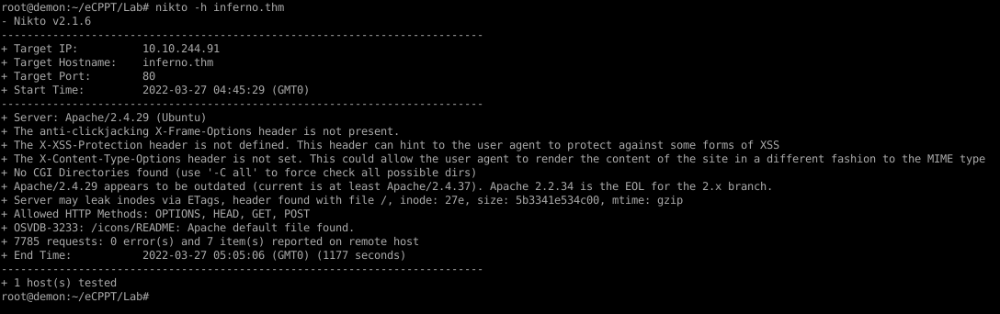

<br />

### Web Directory Scans : 
<br />

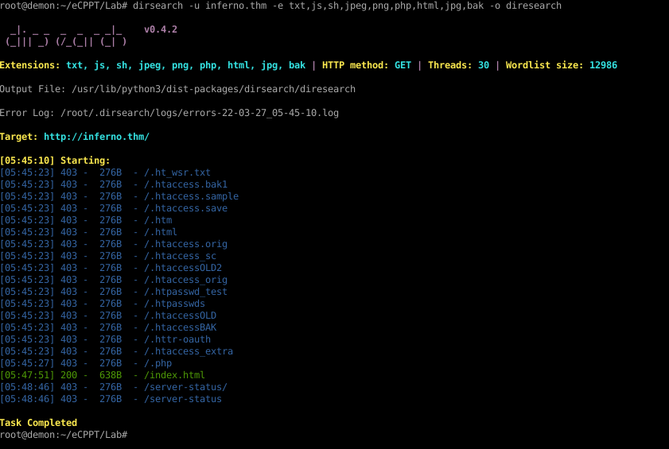

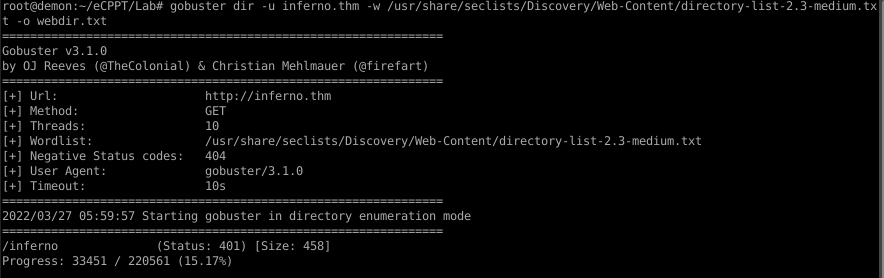

<br />
 
### Text on Website : ( It was in italian )
<br />

```
Oh how great a surprise it seemed to me
when I saw three faces in his head!
One before, and that was vermilion;

the other two were added to this one
over the middle of each shoulder,
and if you reach the place of the crest
```
### HTTP AUTH FOUND :

<br />

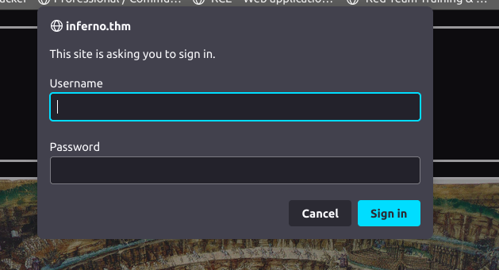


### Brute Force :

User List : 

```
root
admin
administrator
inferno
dante
```

Syntax :

```
hydra -L users.txt -P rockyou.txt inferno.thm http-head /inferno 
```

Results : 

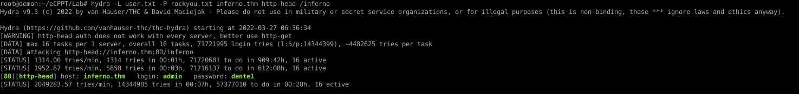

### Login Panel Behind HTTP AUTH :
<br />


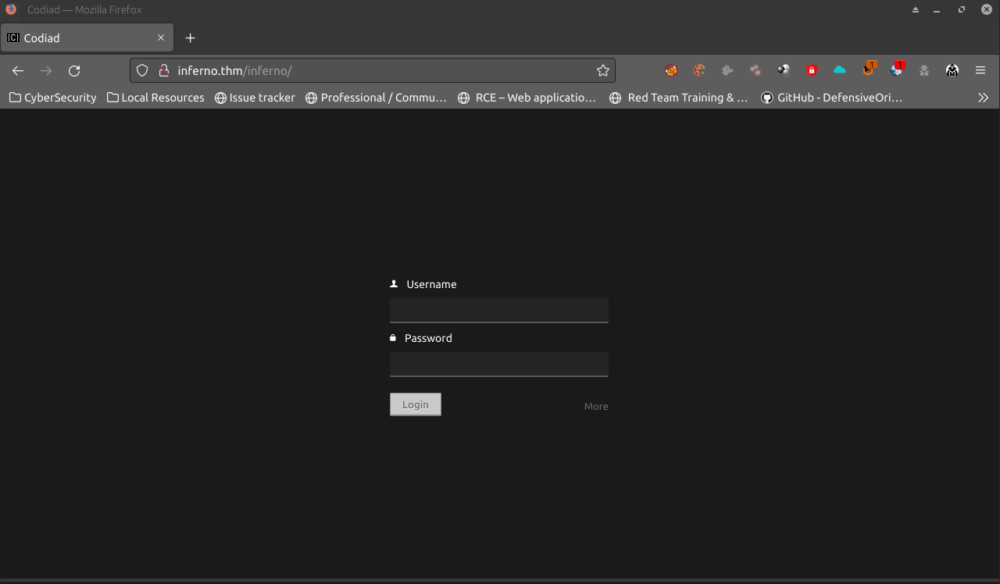

### This is what we see when we login it is some kind of out of date old IDE we found a few exploit when googling!

<br />

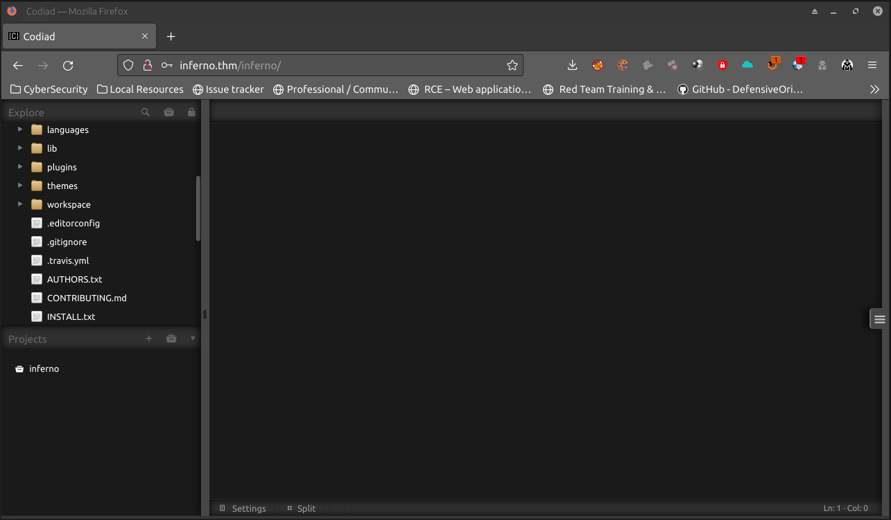

#### The exploit we used: https://github.com/WangYihang/Codiad-Remote-Code-Execute-Exploit

<br />


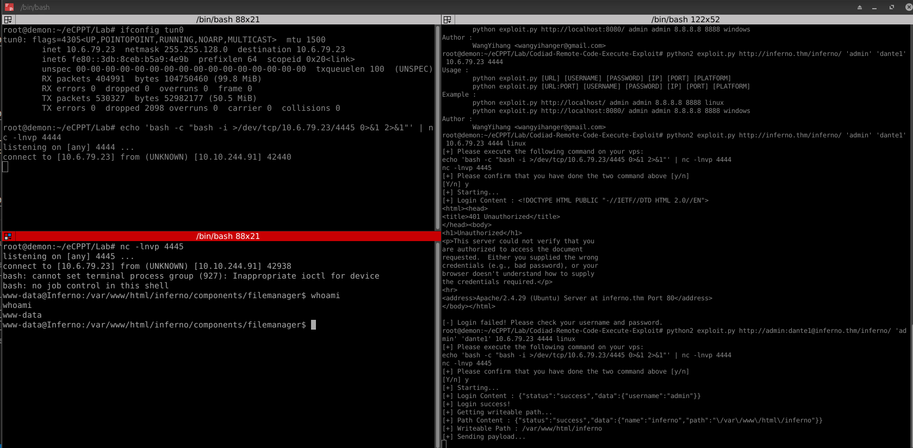

#### We found this in the downloads directory ( Shell Kept Crashing )

<br /> 

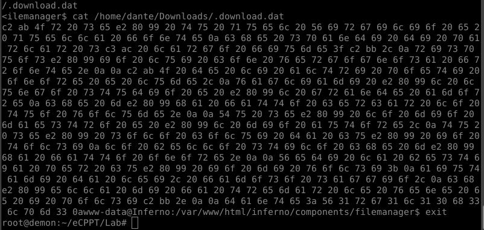

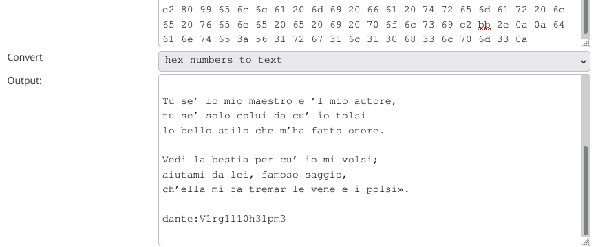

### FOUND POSSIBLE CREDS! 

And we got ssh access!

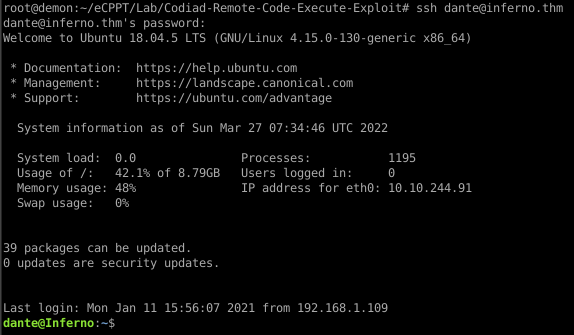

### sudo -l to root


### Rooted the system! 

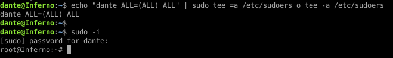

