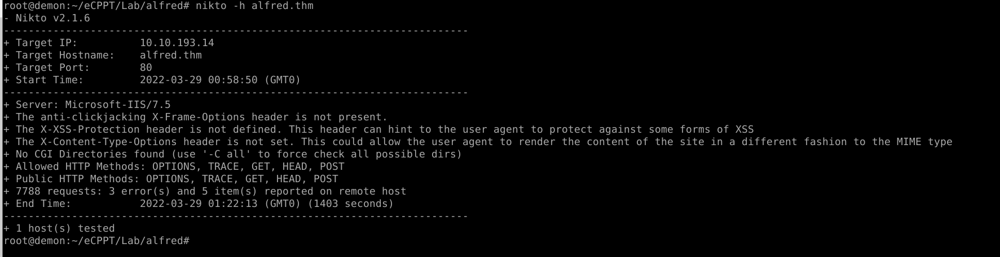
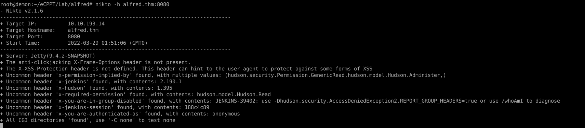
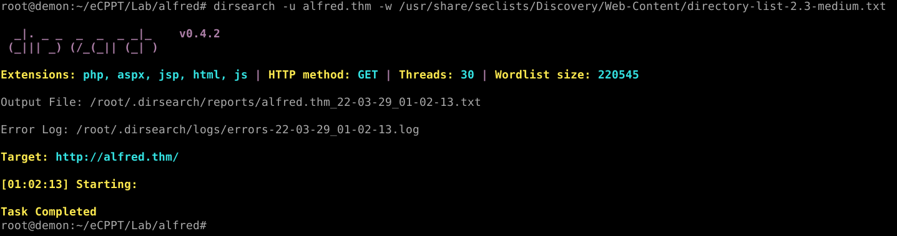
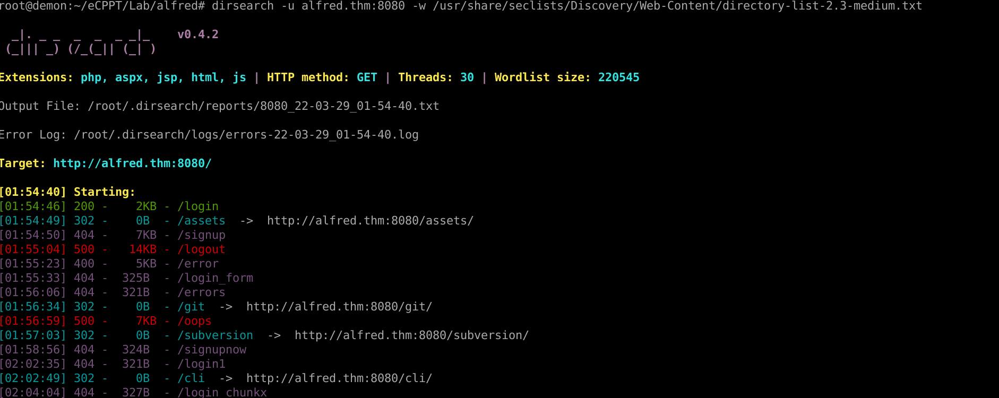
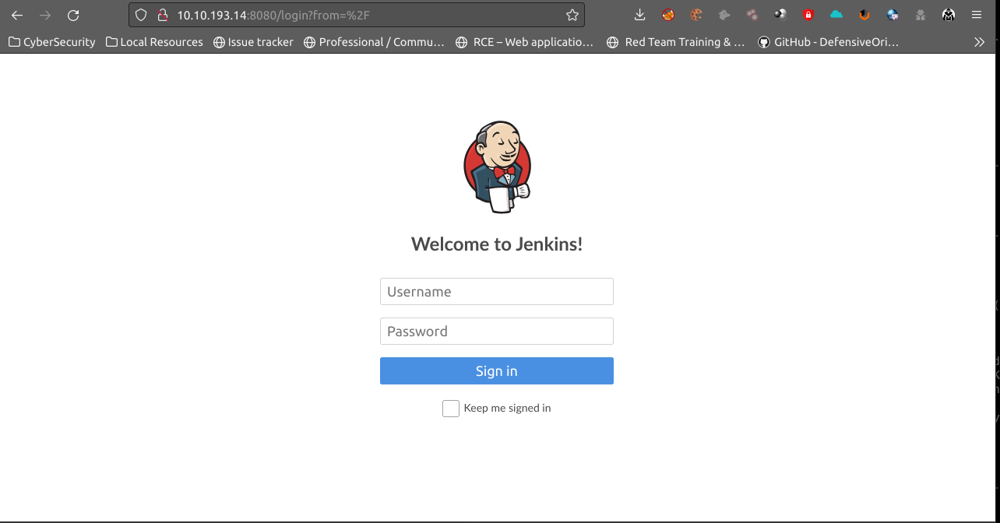

# Alfred Try Hack Me ( Parrotassassin15 )

### Target Information :

<br />

Server : Windows 10 <br>
Ports Open : 80, 3389, 22  <br>
Web Server :  Microsoft-IIS/7.5<br> 
Vulnerability : Weak AUTH<br>
Web Technologies : Jenkins (Jetty 9.4.z-SNAPSHOT)
<br />

<br />

### Areas Of Interest :

* Jetty 9.4.z-SNAPSHOT
* HTTP VERBS: OPTIONS, TRACE, GET, HEAD, POST 


<br>

### Initial Nmap Scan :
<br>

```
root@demon:~/eCPPT/Lab/alfred# nmap -sV -sC alfred.thm -oA alfred -Pn
Starting Nmap 7.92 ( https://nmap.org ) at 2022-03-29 00:51 UTC
Nmap scan report for alfred.thm (10.10.193.14)
Host is up (0.20s latency).
Not shown: 997 filtered tcp ports (no-response)
PORT     STATE SERVICE            VERSION
80/tcp   open  http               Microsoft IIS httpd 7.5
|_http-title: Site doesn't have a title (text/html).
| http-methods: 
|_  Potentially risky methods: TRACE
|_http-server-header: Microsoft-IIS/7.5
3389/tcp open  ssl/ms-wbt-server?
| rdp-ntlm-info: 
|   Target_Name: ALFRED
|   NetBIOS_Domain_Name: ALFRED
|   NetBIOS_Computer_Name: ALFRED
|   DNS_Domain_Name: alfred
|   DNS_Computer_Name: alfred
|   Product_Version: 6.1.7601
|_  System_Time: 2022-03-29T01:18:26+00:00
|_ssl-date: 2022-03-29T01:18:29+00:00; +2s from scanner time.
| ssl-cert: Subject: commonName=alfred
| Not valid before: 2022-03-28T00:45:27
|_Not valid after:  2022-09-27T00:45:27
8080/tcp open  http               Jetty 9.4.z-SNAPSHOT
| http-robots.txt: 1 disallowed entry 
|_/
|_http-title: Site doesn't have a title (text/html;charset=utf-8).
|_http-server-header: Jetty(9.4.z-SNAPSHOT)
Service Info: OS: Windows; CPE: cpe:/o:microsoft:windows

Host script results:
|_clock-skew: mean: 1s, deviation: 0s, median: 1s

Service detection performed. Please report any incorrect results at https://nmap.org/submit/ .
Nmap done: 1 IP address (1 host up) scanned in 1637.31 seconds
root@demon:~/eCPPT/Lab/alfred# 
```

<br>

### Nikto Scans :
<br>

For port 80: 



For port 8080: 



<br>


### Web Directory Scans :

<br>

Nothing for port 80 :




For port 8080 : 



<br>

## Login Panel :

<br>




## Brute Force :
<br>


```
hydra -s 8080 alfred.thm http-form-post "/j_acegi_security_check:j_username=^USER^&j_password=^PASS^:Invalid username or password" -L user.txt -P rockyou.txt 
```
