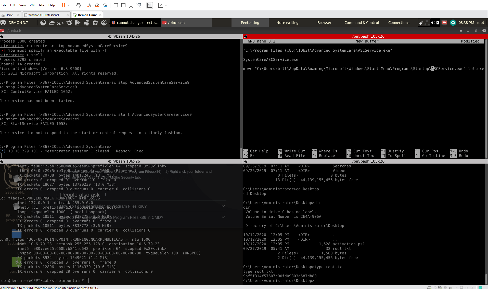

# Steel Mountain Try Hack Me ( Parrotassassin15 )

# DID NOT MAKE NOTES 

( I will need to come back sand do that )

 

### Target Information :
 
IP address: 10.10.229.101  
Server : Microsoft Windows Server 2008 R2   
Ports Open : 80, 135, 139, 445, 3389, 8080 ( A bunch of MSRPC ports )  
Web Server : MS IIS httpd 8.5   
Vulnerability : RCE  
Web Technologies :  

 
 

### Areas Of Interest :

 

### Initial Nmap Scan :

 

### Nikto Scan :

 

### Web Directory Scans : 

